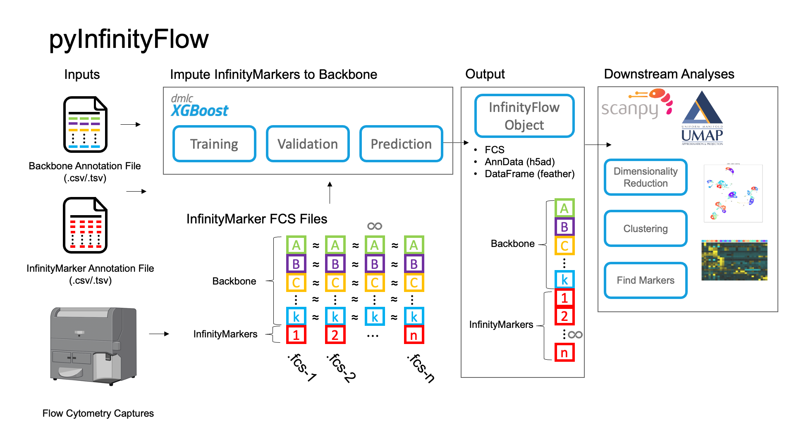

# pyInfinityFlow

**pyInfinityFlow** is a Python package that enables imputation of hundreds of features from Flow Cytometry using XGBoost regression. It is an adaptation of the [original implementation in R](https://github.com/ebecht/infinityFlow)[<sup>1</sup>](https://www.science.org/doi/full/10.1126/sciadv.abg0505) with the goal of optimizing the workflow for large datasets by increasing the speed and memory efficiency of the analysis pipeline. 

The package includes tools to read and write FCS files, following the FCS3.1 file standard, into AnnData objects, allowing for easy downstream analysis of single-cell data with [Scanpy](https://scanpy.readthedocs.io/en/stable/index.html)[<sup>2</sup>](https://genomebiology.biomedcentral.com/articles/10.1186/s13059-017-1382-0?ref=https://githubhelp.com) and [UMAP](https://umap-learn.readthedocs.io/en/latest/index.html)[<sup>3</sup>](https://arxiv.org/abs/1802.03426).

Read more about the pyInfinityFlow package on its Read the Docs page!


## Graphical Summary


## Recommended Installation
It is recommended to set up a virtual environment to install the package.

Creating a new conda environment and installing pyInfinityFlow:
```console
conda create -n pyInfinityFlow python=3.8
conda activate pyInfinityFlow

pip install pyInfinityFlow
```

Then pyInfinityFlow will be installed in a conda environment named 'pyInfinityFlow'.


## Quickstart
To run the pyInfinityFlow pipeline, we can use this command:

```console
pyInfinityFlow --data_dir /home/kyle/Documents/GitHub/pyInfinityFlow/example_data/mouse_lung_dataset_subset/ \
    --out_dir /media/kyle_ssd1/example_outputs/ \
    --backbone_annotation /home/kyle/Documents/GitHub/pyInfinityFlow/example_data/mouse_lung_dataset_subset_backbone_anno.csv \
    --infinity_marker_annotation /home/kyle/Documents/GitHub/pyInfinityFlow/example_data/mouse_lung_dataset_subset_infinity_marker_anno.csv
```

## Selected References
[<font size="2"><sup>1</sup> Becht, E., Tolstrup, D., Dutertre, C. A., Morawski, P. A., Campbell, D. J., Ginhoux, F., ... & Headley, M. B. (2021). High-throughput single-cell quantification of hundreds of proteins using conventional flow cytometry and machine learning. Science advances, 7(39), eabg0505. </font>](https://www.science.org/doi/full/10.1126/sciadv.abg0505)

[<font size="2"><sup>2</sup> Wolf, F. A., Angerer, P., & Theis, F. J. (2018). SCANPY: large-scale single-cell gene expression data analysis. Genome biology, 19(1), 1-5. </font>](https://genomebiology.biomedcentral.com/articles/10.1186/s13059-017-1382-0?ref=https://githubhelp.com)

[<font size="2"><sup>3</sup> McInnes, L., Healy, J., & Melville, J. (2018). Umap: Uniform manifold approximation and projection for dimension reduction. arXiv preprint arXiv:1802.03426. </font>](https://arxiv.org/abs/1802.03426)
